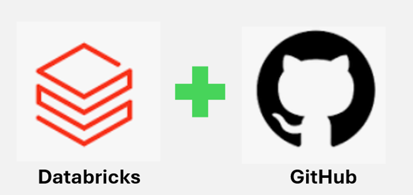

# Projetos

Esse repositário é gravado todos os Projetos criados no databricks via **Databricks\Repos**
1. **[BPC](BPC)** - Beneficio de Prestação continuada
2. **[Cervejaria](cervejarias_americanas)** - API de cervejaria norte americanas 
3. **[Numero da Mega](Numeros_da_MegaSena)** - Web Scraping de um site que posta os resutados da mega-sena
4. **[Sistema Bancario](sistema_bancario)** - Projeto de POO em Python da DIO

Fique a vontade para verificar cada um dos projetos

---

## Estou pensando em mudar a logo do SQL DICAS para essa:

_modificação:_
* remoção do quadro com a Letra **W**
